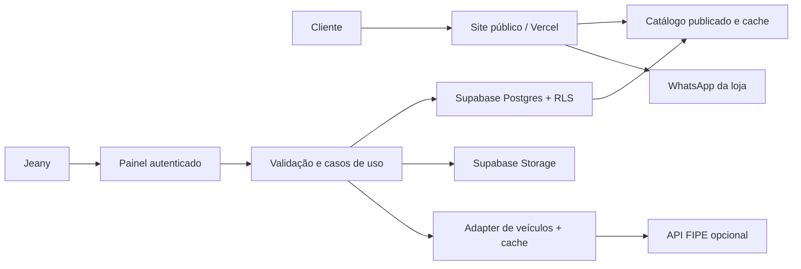

# Arquitetura, dados e validação

Decisões atualizadas em 09/09/2026 no [plano executivo](04-plano-executivo-revisado.md): schema catalog com store_id e associações independentes do staff BYTHE; staging privado e publicação de imagens; páginas com preço inicialmente sem cache persistente; API FIPE opcional. As alternativas preliminares abaixo devem ser lidas à luz dessas decisões.

Documento de decisão preliminar; não contém implementação ou migrations. Validar este modelo com amostras do estoque antes de gerar schema.

## Estratégia

Monólito modular em Next.js com TypeScript: páginas públicas renderizadas no servidor e cacheadas, painel com interatividade apenas onde necessário, Supabase Postgres/Auth/Storage. Publicação em projeto Vercel da BYTHE com plano comercial. Não criar microserviços, mecanismo de busca externo ou arquitetura de marketplace para o volume inicial.



## Camadas propostas

`src/app` para páginas/rotas; `src/modules/catalog`, `promotions`, `vehicles`, `admin`, `store` para domínio. Em cada módulo, separar `types`, `validators`, `useCases`, `repositories`, `services` e componentes quando aplicáveis. `src/components` para UI compartilhada; `src/hooks` para estado de interface; `src/middlewares` para funções transversais; `src/tests` para integrações e jornadas. Evitar camadas vazias ou classes que só repassam chamadas.

Repositórios encapsulam Supabase; casos de uso aplicam publicação, expiração e autorização; adapters encapsulam FIPE/WhatsApp. DTOs tipados nas fronteiras. Server Components nas leituras públicas. Estado local no cadastro; React Query só se simplificar sincronização real do painel; Zustand não é necessário inicialmente. Revisar documentação atual do framework e Supabase antes de codificar.

## Modelo de dados proposto

| Entidade | Campos/relações essenciais |
|---|---|
| stores | Identidade comercial, slug, contato público, horários, domínio; sem dados particulares do contrato |
| store_memberships | store_id + auth_user_id, papel owner/editor, ativo; associação administrada por usuário autorizado |
| categories | store_id, nome, slug, ordem; categorias locais ao catálogo |
| products | store_id, category_id, SKU, slug, nome, marca da peça, descrição, condição, preço em centavos, publicação, disponibilidade, timestamps |
| product_images | store_id, product_id, caminho do objeto, posição, alt, bytes/dimensões |
| product_promotions | store_id, product_id, preço promocional, preço anterior real, início/fim, flags confirmadas de estoque limitado/sem reposição |
| vehicle_variants | tipo, marca, modelo/versão, código externo opcional, origem; evitar duplicação por chave normalizada |
| product_applications | store_id, product_id, vehicle_variant_id opcional, anos inicial/final, motor/combustível/transmissão/lado quando relevantes, observações, status de conferência, fonte |
| banners | store_id, imagem, texto, destino permitido, ordem, ativo e período |
| audit_events | store_id, ator, ação, entidade, data e request_id; sem senhas/tokens ou conteúdo pessoal desnecessário |

Separar `publication_status` (draft/published/archived) de `availability_status` (available/limited/out_of_stock/on_request). Estoque inicialmente é informação manual de disponibilidade. Quantidade numérica só se a loja mantiver rotina confiável; não criar inventário concorrente ao ERP.

Relacionamentos compostos devem impedir que produto de uma empresa aponte para categoria, imagem, promoção ou aplicação de outra. SKU/slug únicos por loja, índice composto tenant/status/categoria, índice para período/promocional e busca textual indexada em nome/código/marca. Paginar a listagem e carregar relações em lote, evitando N+1. Valores monetários inteiros; datas com fuso explícito, exibição America/Sao_Paulo.

Uma promoção vigente por produto; validar intervalos e prevenir sobreposição. Ano inicial <= final; aplicação não conferida não ganha selo afirmativo. Aplicação sem variante externa continua possível com descrição manual.

## Isolamento e autenticação

Infraestrutura Supabase compartilhada é permitida no contrato, mas depende de revisão da arquitetura já usada pela BYTHE. `store_id` por si só não protege dados. RLS em todas as tabelas expostas; permissões de leitura pública apenas para dados publicáveis da loja; escrita somente por associação ativa autorizada. Checar tenant em banco e servidor, inclusive em joins e Storage.

Não expor memberships, rascunhos, auditoria e configurações privadas em views públicas. Preferir schema privado ou views com comportamento de segurança explícito. Não confiar em `user_metadata` para papéis. Chave `service_role` nunca no browser; usar sessão do usuário e chaves públicas adequadas com RLS. Conta de administrador criada por convite, sem cadastro público. MFA para operadores BYTHE; recuperação de Jeany preparada e testada.

Imagem de produto já publicada pode estar em bucket público; rascunhos sensíveis não. Se usar bucket público, documentar que URL continua acessível independentemente do status do produto, ou promover arquivos de bucket privado para público apenas ao publicar. Caminhos por empresa/produto e políticas para insert/select/update/delete; evitar privilégios amplos de upsert. [Supabase RLS](https://supabase.com/docs/guides/database/postgres/row-level-security).

## Segurança e operação

Validar payload no servidor, limites de campos e enumerações; queries parametrizadas; escape de texto e JSON-LD; sem HTML livre na descrição. Verificar origem/CSRF nas mutações com cookie, autorização por registro e sessão vigente. Rate limiting persistente para login, upload e proxy de API; memória local serverless não é controle global.

Uploads: limitar bytes/dimensões/quantidade, validar assinatura real do arquivo, reprocessar imagens e remover EXIF; aceitar formatos necessários e rejeitar SVG/HTML ativos. Evitar busca de imagens por URL arbitrária (SSRF). Links de banners internos ou hosts permitidos; bloquear protocolos perigosos. Senhas geridas pelo Auth, nunca em tabela própria; HTTPS, segredos de ambiente e logs sem credenciais.

Backups: banco e arquivos precisam de estratégias distintas. Os backups de banco Supabase não restauram objetos do Storage. Propor backup diário do banco conforme plano e cópia incremental das imagens em destino independente com retenção inicial de sete dias, ajustada ao custo. Testar restauração de uma peça e suas imagens antes do lançamento. Recuperação por tenant não pode sobrescrever os outros clientes do ambiente compartilhado. RPO diário é meta operacional a validar, não SLA já contratado. [Backups Supabase](https://supabase.com/docs/guides/platform/backups).

Coletar o mínimo: não solicitar CPF/placa/chassi de visitantes na V1; permitir que a conversa técnica continue no WhatsApp. Política de privacidade deve corresponder às ferramentas realmente ativadas. Métricas e cookies opcionais dependem de configuração e avaliação antes de publicar, não de um banner genérico.

## API interna proposta

REST para operações do painel que precisem de endpoints. Gerar OpenAPI a partir dos schemas e documentar erros; não manter documento separado divergente. Exemplo ilustrativo de payload, **sem representar produto real**:

```http
POST /api/admin/products
Content-Type: application/json

{"sku":"DEMO-001","name":"Peça de demonstração","categoryId":"uuid","priceCents":12990,"publicationStatus":"draft","availabilityStatus":"available"}
```

```json
{"data":{"id":"uuid","sku":"DEMO-001","publicationStatus":"draft"},"requestId":"uuid"}
```

Resposta 201 na criação; 400 para JSON malformado; 401 sem sessão; 403 sem permissão; 404 recurso não acessível; 409 SKU duplicado; 422 regra inválida; 429 limite. Exemplo de erro: `{"error":{"code":"INVALID_PRICE","message":"Informe um preço válido.","field":"priceCents"},"requestId":"uuid"}`. Tenant é resolvido no servidor a partir da associação autorizada, não aceito cegamente do body.

## Performance e escala

Evitar carregar catálogo inteiro no cliente. Paginação sugerida de 24 itens, busca indexada e debounce. Fotos em tamanhos responsivos e WebP/AVIF, lazy loading abaixo da dobra; imagem principal priorizada. Compressão e variantes no upload evitam transformação dinâmica ilimitada. Cache público com chave incluindo loja, filtros e página; painel autenticado sem cache público. Invalidar páginas afetadas ao publicar/preço/esgotar e respeitar fim da promoção.

Metas de validação: LCP <= 2,5 s, INP <= 200 ms e CLS <= 0,1 quando houver dados de campo; antes do lançamento usar simulação móvel representativa. Metas não são resultado medido. [Core Web Vitals](https://web.dev/articles/vitals).

100 mil usuários deve ser dimensionado como visitantes por período, não como 100 mil usuários de Auth: consumidores não fazem login. CDN e cache reduzem banco, mas imagens e bots geram tráfego. Exemplo de carga, não previsão: 100 mil visitas × 1,5 MB transferidos ≈ 150 GB; cinco páginas nesse tamanho por visita ≈ 750 GB. Aumento de audiência exige revisar custos, índices, acertos de cache e concorrência real. Não prometer suporte a 100 mil acessos simultâneos no plano inicial.

## Estratégia de testes e aceite

| Nível | Casos necessários |
|---|---|
| Unitários | Desconto e arredondamento, preço inválido, fim de promoção/fuso, serialização WhatsApp com acentos, validação de intervalo, ausência de aplicação não virar incompatibilidade |
| Integração | RLS anon/editor/outra loja, FKs cruzadas, rascunhos privados, upload inválido, SKU duplicado, transação parcial, promoção expirada, atualização do cache |
| Integração API | Resposta normal, timeout, 429, schema inesperado, cache/fallback manual; token ausente/expirado sem quebrar catálogo |
| Jornada | Login → criar rascunho → fotos → publicar → pesquisar → WhatsApp; editar preço; marcar esgotado; arquivar; recuperar senha |
| Acessibilidade/usabilidade | Teclado, foco, contraste, zoom 200%, celular pequeno, erro legível e sessão expirada; teste com Jeany |
| SEO/operação | Sitemap, canonical, JSON-LD válido, páginas publicadas no HTML, previews/admin fora do índice, restauração de banco + imagem |

Concluir somente com isolamento negativo aprovado (outro cliente não lê/escreve dados privados), produto não publicado invisível, imagens recuperáveis, WhatsApp correto e homologação dos materiais reais. Hoje foram testadas apenas consultas públicas da FIPE e conferidos documentos/assets; não houve teste de aplicação, pois ela ainda não existe.
